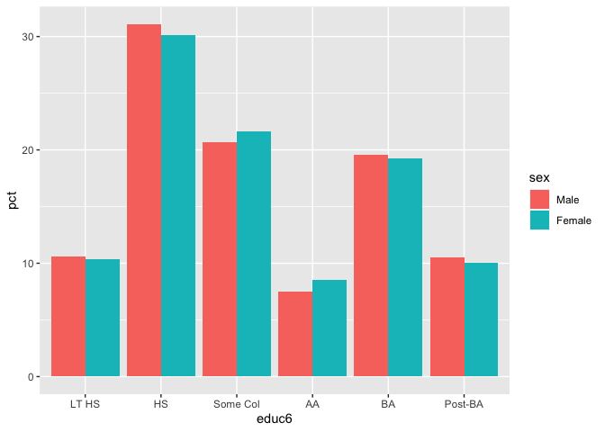
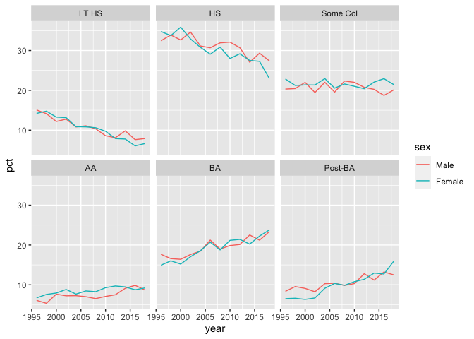
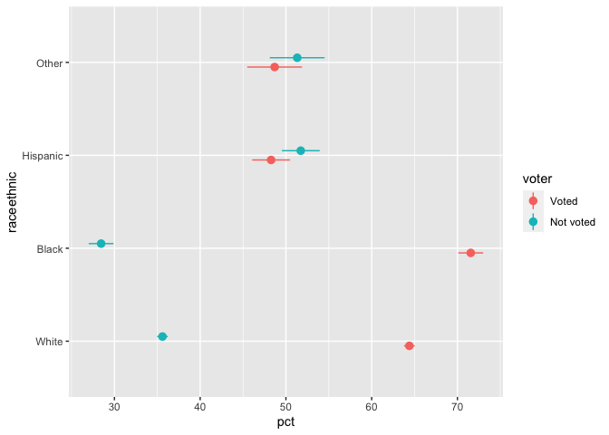

Weighted data survey tables in R
================
John Johnson
3/4/2020

`pollster` is an R package for making topline and crosstab tables of
simple weighted survey data. The package is designed for use with
labelled data, like what you might use the `haven` package to import
from Stata or SPSS. It follows tidyverse programming conventions, and
output tables are also in the form of a tidy data frame, or tibble.

Only simple weights are currently supported. For complex survey designs,
we recommend the excellent [`survey`
package](http://r-survey.r-forge.r-project.org/survey/).

The core functions are:

  - `topline()`
  - `crosstab()`
  - `crosstab_3way()`

Each function also has a twin version which includes a column for the
margin of error calculated to include the design effect of the weights.

  - `moe_topline()`
  - `moe_crosstab()`
  - `moe_crosstab_3way()`

There are also two special functions which calculate the design effect
component of the margin of error for each survey wave independently.

  - `moe_wave_crosstab()`
  - `moe_wave_crosstab_3way()`

## Installation

Install it this way.

    devtools::install_github("jdjohn215/pollster")

## Basic useage

`pollster` includes a dataset of Illinois responses to the Current
Population Survey’s voter registration supplement.

``` r
library(pollster)
head(illinois)
```

    ## # A tibble: 6 x 9
    ##    year     fips     sex   educ6 raceethnic maritalstatus      rv   voter weight
    ##   <dbl> <dbl+lb> <dbl+l> <dbl+l>  <dbl+lbl>     <dbl+lbl> <dbl+l> <dbl+l>  <dbl>
    ## 1  1996  17 [IL] 1 [Mal… 2 [HS]   1 [White] 1 [Married]   2 [Not… 2 [Not…  2037.
    ## 2  1996  17 [IL] 2 [Fem… 3 [Som…  1 [White] 1 [Married]   1 [Reg… 1 [Vot…  2067.
    ## 3  1996  17 [IL] 2 [Fem… 2 [HS]   1 [White] 3 [Never Mar… 1 [Reg… 1 [Vot…  1871.
    ## 4  1996  17 [IL] 2 [Fem… 2 [HS]   1 [White] 3 [Never Mar… 1 [Reg… 1 [Vot…  1902.
    ## 5  1996  17 [IL] 1 [Mal… 2 [HS]   2 [Black] 1 [Married]   1 [Reg… 1 [Vot…  1622.
    ## 6  1996  17 [IL] 2 [Fem… 2 [HS]   2 [Black] 1 [Married]   1 [Reg… 1 [Vot…  1330.

Make a topline table like this. The output is a tibble.

``` r
topline(variable = maritalstatus, df = illinois, weight = weight)
```

    ## # A tibble: 3 x 5
    ##   Response           Frequency Percent `Valid Percent` `Cumulative Percent`
    ##   <fct>                  <dbl>   <dbl>           <dbl>                <dbl>
    ## 1 Married            55001786.    53.6            53.6                 53.6
    ## 2 Widow/divorced/Sep 18635087.    18.1            18.1                 71.7
    ## 3 Never Married      29041640.    28.3            28.3                100

Make a crosstab like this.

``` r
crosstab(x = educ6, y = maritalstatus, df = illinois, weight = weight)
```

    ## # A tibble: 6 x 5
    ##   educ6    Married `Widow/divorced/Sep` `Never Married`         n
    ##   <fct>      <dbl>                <dbl>           <dbl>     <dbl>
    ## 1 LT HS       40.0                 29.1            30.9 10770999.
    ## 2 HS          52.9                 21.0            26.1 31409418.
    ## 3 Some Col    44.6                 17.4            38.0 21745113.
    ## 4 AA          57.4                 18.4            24.2  8249909.
    ## 5 BA          61.1                 11.3            27.6 19937965.
    ## 6 Post-BA     70.7                 12.9            16.5 10565110.

If you prefer, you can also get the output in long
format.

``` r
crosstab(x = educ6, y = maritalstatus, df = illinois, weight = weight, format = "long")
```

    ## # A tibble: 18 x 4
    ##    educ6    maritalstatus        pct         n
    ##    <fct>    <fct>              <dbl>     <dbl>
    ##  1 LT HS    Married             40.0 10770999.
    ##  2 LT HS    Widow/divorced/Sep  29.1 10770999.
    ##  3 LT HS    Never Married       30.9 10770999.
    ##  4 HS       Married             52.9 31409418.
    ##  5 HS       Widow/divorced/Sep  21.0 31409418.
    ##  6 HS       Never Married       26.1 31409418.
    ##  7 Some Col Married             44.6 21745113.
    ##  8 Some Col Widow/divorced/Sep  17.4 21745113.
    ##  9 Some Col Never Married       38.0 21745113.
    ## 10 AA       Married             57.4  8249909.
    ## 11 AA       Widow/divorced/Sep  18.4  8249909.
    ## 12 AA       Never Married       24.2  8249909.
    ## 13 BA       Married             61.1 19937965.
    ## 14 BA       Widow/divorced/Sep  11.3 19937965.
    ## 15 BA       Never Married       27.6 19937965.
    ## 16 Post-BA  Married             70.7 10565110.
    ## 17 Post-BA  Widow/divorced/Sep  12.9 10565110.
    ## 18 Post-BA  Never Married       16.5 10565110.

A three-way crosstab is just a normal crosstab with a third control
variable. Often, this third variable is
time.

``` r
crosstab_3way(x = educ6, y = maritalstatus, z = year, df = illinois, weight = weight)
```

    ## # A tibble: 72 x 6
    ##    educ6 year         n Married `Widow/divorced/Sep` `Never Married`
    ##    <fct> <fct>    <dbl>   <dbl>                <dbl>           <dbl>
    ##  1 LT HS 1996  1182402.    41.0                 28.8            30.2
    ##  2 LT HS 1998  1159148.    42.2                 33.6            24.2
    ##  3 LT HS 2000  1036154.    44.3                 32.6            23.1
    ##  4 LT HS 2002  1074704.    38.0                 30.4            31.6
    ##  5 LT HS 2004   936926.    41.0                 30.3            28.6
    ##  6 LT HS 2006   918858.    38.6                 31.7            29.7
    ##  7 LT HS 2008   909755.    42.1                 28.1            29.8
    ##  8 LT HS 2010   806647.    40.6                 24.6            34.7
    ##  9 LT HS 2012   705132.    35.7                 26.9            37.4
    ## 10 LT HS 2014   782926.    43.7                 23.7            32.7
    ## # … with 62 more rows

## Making tables and graphs

Wide format is best for displaying table output. Long format is best for
making graphs. `pollster` outputs dovetail seamlessly with
[`knitr::kable()`](https://www.rdocumentation.org/packages/knitr/versions/1.28/topics/kable)
and [`ggplot2::ggplot()`](https://ggplot2.tidyverse.org/). These
examples show very basic html table output, but you can customize the
appearance of your tables almost endlessly in either html or pdf formats
using Hao Zhu’s excellent [`kableExtra`
package](https://haozhu233.github.io/kableExtra/).

``` r
library(dplyr)
```

    ## 
    ## Attaching package: 'dplyr'

    ## The following objects are masked from 'package:stats':
    ## 
    ##     filter, lag

    ## The following objects are masked from 'package:base':
    ## 
    ##     intersect, setdiff, setequal, union

``` r
crosstab(x = sex, y = educ6, df = illinois, weight = weight) %>%
  knitr::kable(digits = 0)
```

| sex    | LT HS | HS | Some Col | AA | BA | Post-BA |        n |
| :----- | ----: | -: | -------: | -: | -: | ------: | -------: |
| Male   |    11 | 31 |       21 |  7 | 20 |      11 | 49108796 |
| Female |    10 | 30 |       22 |  9 | 19 |      10 | 53569718 |

``` r
library(ggplot2)
crosstab(x = sex, y = educ6, df = illinois, weight = weight, format = "long") %>%
  ggplot(aes(educ6, pct, fill = sex)) +
  geom_bar(stat = "identity", position = "dodge")
```

<!-- -->

Three-way crosstabs are ideal for plotting time series graphs and/or
faceted
plots.

``` r
crosstab_3way(x = sex, y = educ6, z = year, df = illinois, weight = weight, format = "long") %>%
  mutate(year = as.numeric(as.character(year))) %>%
  ggplot(aes(year, pct, col = sex)) +
  geom_line() +
  facet_wrap(facets = vars(educ6))
```

<!-- -->

## Margin of error

Each `pollster` function comes with a twin function which includes a
margin of error column. For example:

``` r
moe_topline(variable = voter, df = illinois, weight = weight)
```

    ## # A tibble: 2 x 6
    ##   Response  Frequency Percent `Valid Percent`   MOE `Cumulative Percent`
    ##   <fct>         <dbl>   <dbl>           <dbl> <dbl>                <dbl>
    ## 1 Voted     56230937.    63.7            63.7 0.551                 63.7
    ## 2 Not voted 32070164.    36.3            36.3 0.551                100

By default, `moe_crosstab` output comes in long format, but you can also
specify wide
format.

``` r
moe_crosstab(x = raceethnic, y = voter, df = illinois, weight = weight, format = "wide")
```

    ## # A tibble: 4 x 6
    ##   raceethnic     n pct_Voted `pct_Not voted` moe_Voted `moe_Not voted`
    ##   <fct>      <int>     <dbl>           <dbl>     <dbl>           <dbl>
    ## 1 White      24167      64.4            35.6     0.624           0.624
    ## 2 Black       3980      71.6            28.4     1.45            1.45 
    ## 3 Hispanic    2106      48.3            51.7     2.21            2.21 
    ## 4 Other       1006      48.7            51.3     3.19            3.19

``` r
moe_crosstab(x = raceethnic, y = voter, 
             df = illinois, 
             weight = weight) %>%
  ggplot(aes(x = pct, y = raceethnic, xmin = (pct - moe), xmax = (pct + moe), color = voter)) +
  geom_pointrange(position = position_dodge(width = 0.2))
```

<!-- -->
